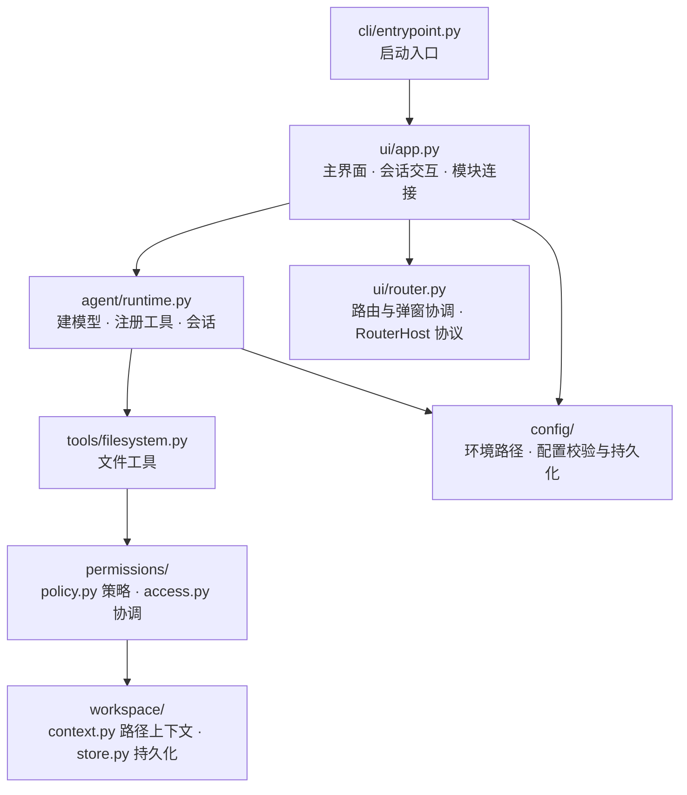

# Local CodeAgent

一个用来学 [smolagents](https://github.com/huggingface/smolagents) 的终端编码 Agent 练习项目。界面用 [Textual](https://textual.textualize.io/)，模型接任意 OpenAI 兼容端点（本地 LM Studio 就够）。


## 为什么做这个

看文档学 smolagents 不够，得有个真实场景把 CodeAgent、工具注册、执行循环串一遍。所以做了这个：Agent 能真的读写磁盘文件，代码量又小到改一处就能看见一处效果。

刻意保持简单，有几条线不碰：

- 不做多 Agent 编排、向量检索、工作流引擎。
- 能复用 smolagents 原生能力的地方一律复用，不自己造执行循环、不自己造步骤与用量统计。
- 按职责分目录，依赖单向向下，方便顺着调用链读代码。

## 跑起来

前置：Python ≥ 3.13、[uv](https://docs.astral.sh/uv/getting-started/installation/)，以及一个可用的 OpenAI 兼容端点。

```sh
git clone <repo-url> && cd learn_smolagents

# 安装锁定依赖并启动 TUI
sh scripts/environment.sh development
```

也能这样启动：

```sh
uv run local-codeagent              # 安装后的命令入口
uv run python -m learn_smolagents   # 模块入口
uv run python main.py               # 保留的薄入口
```

首次启动没有模型配置，点标题栏的「LLM 配置」填模型名、完整 API 地址和密钥，保存后重建 Agent 并开始新会话。工作区用标题栏的「工作区」或 `Ctrl+W` 创建、切换、删除。配置按环境分别保存在 `~/.config/learn-smolagents/<环境>/`，源码里不含任何密钥。

`scripts/environment.sh` 还带另外两个环境，都可在末尾加 `setup` 只安装、不启动：

| 环境 | 用途 | Python 环境 |
| --- | --- | --- |
| development（默认） | 跑 TUI | `.venv/` |
| test | 跑 pytest | `.venv-test/` |
| production | `--no-dev --no-editable` 安装后运行 | `.venv-production/` |

## 练到了什么

按主题记录这个项目实际用到的能力，以及对应的代码位置：

| 主题 | 看哪里 |
| --- | --- |
| 用 `@tool` 写自定义工具，写 Google 风格 `Args:` 描述 | `tools/filesystem.py` |
| CodeAgent 注册工具、用 `instructions` 注入约束、管理会话 | `agent/runtime.py` |
| 消费原生 `ToolCall`、`ActionStep`、`RunResult`、`TokenUsage` | `agent/runtime.py` |
| 按轮切分 token 统计，而不是用累计值 | `agent/runtime.py` |
| 在工具入口做权限拦截，工作区外弹审批 | `permissions/` |
| Textual 组件化、屏幕路由、宽窄屏适配 | `ui/` |
| 用 `Protocol` 声明结构化类型，断开模块之间的引用回环 | `ui/router.py` |
| 环境隔离与配置落盘 | `scripts/environment.sh`、`config/` |

## 权限策略

这个项目里唯一值得单独贴代码的设计，就是一个纯函数——简单到能一眼读完：

```python
def check_permission(target, workspace_root, full_access=False) -> str:
    if full_access:
        return "allow"
    if target.resolve().is_relative_to(workspace_root.resolve(strict=False)):
        return "allow"
    return "ask"
```

工作区内直接放行，工作区外返回 `ask`，由 UI 弹审批屏让用户裁决。所有文件工具都在入口处调它，路径在调用时经 `workspace.resolve()` 解析，没有 `os.chdir()`，也没有手工拼路径绕开边界。

## 代码组织

依赖方向单向向下。`router.py` 需要读宿主 app 的配置存储和 `busy` 状态，为不反向 import `app.py`，用一个 `RouterHost` Protocol 声明结构化类型，环就此断开。



```text
src/learn_smolagents/
├── config/                # 环境路径、LLM 配置校验与本地持久化
├── cli/entrypoint.py      # 命令行启动
├── agent/runtime.py       # 模型调用与 Agent 会话
├── workspace/             # context.py 路径上下文；store.py 持久化
├── permissions/           # policy.py 权限策略；access.py 访问协调
├── ui/                    # TUI：app / router / components / screens / theme
├── tools/filesystem.py    # 文件工具
└── assets/smol-mark.svg   # 应用标识

tests/                     # 隔离配置与文件数据的自动测试
scripts/environment.sh     # 环境安装与运行入口
docs/                      # 开发文档与作业记录
main.py                    # 保留原启动方式的薄入口
```

## 验证

```sh
sh scripts/environment.sh test
```

测试用 `tmp_path` 临时目录，把配置根目录覆盖到每个测试自己的目录，不读写用户配置、不请求真实模型。当前基线：

```text
$ env -u NO_COLOR .venv-test/bin/python -m pytest -q
122 passed
```

> 直接跑 `.venv-test/bin/python -m pytest` 会因 `NO_COLOR` 导致 2 个 RichLog 背景色断言失败，那是环境问题而非代码缺陷。请用上面的脚本，或加 `env -u NO_COLOR` 前缀。

单元测试只覆盖本地逻辑，真实模型调用是另做验收的。

## 当前进度

作业 01「让 Agent 真正操作工作区」已完成，工具契约、关键实现和验收流程见 [docs/assignments/01-file-tools.md](docs/assignments/01-file-tools.md)。

真实模型端到端跑过一轮。跑出来的问题是：用户主动中断本轮执行时，按事件渲染的路径已经静默处理了，但顶层异常分支仍把它渲染成红色错误卡和"请求失败"。两条路径现已统一为中性提示，并补了回归测试。

已按 MIT 许可开源，见 [LICENSE](LICENSE)。

## 文档

| 文档 | 内容 |
| --- | --- |
| [开发与环境管理](docs/development.md) | 日常命令、环境隔离、模块职责、Git 管理约定 |
| [作业 01](docs/assignments/01-file-tools.md) | 工具契约、关键实现、自动验收与真实 API 验收流程 |
